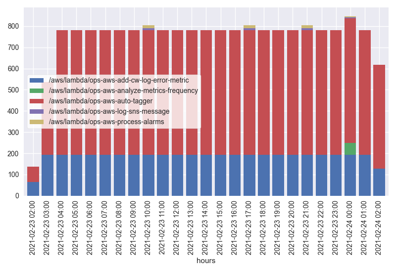
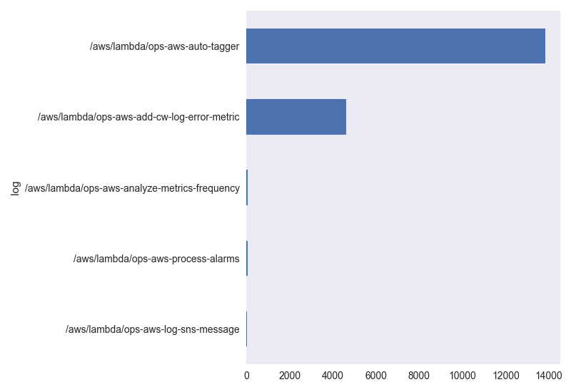
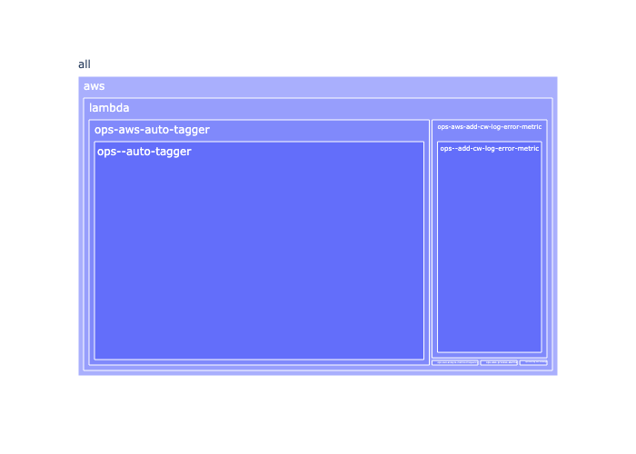
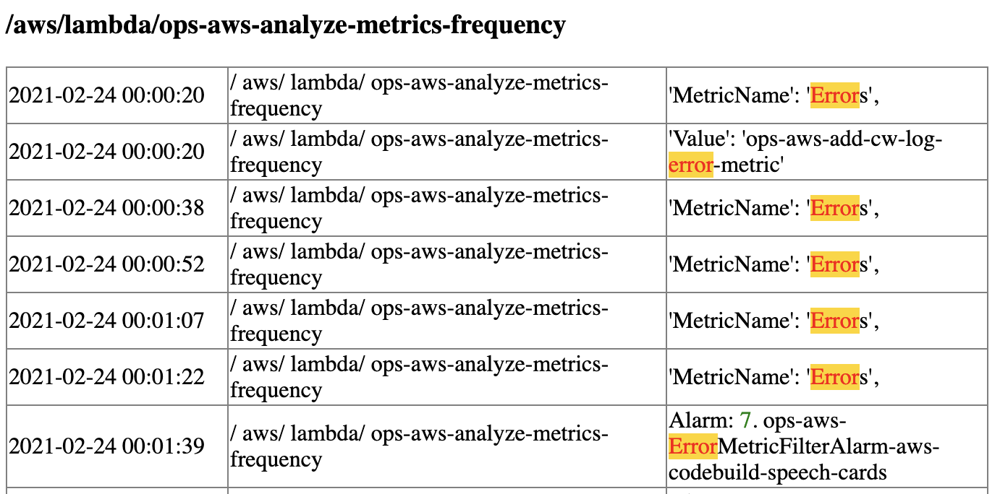

# aws-log-text-forensics 🔎

Set of scripts to download CloudWatch logs locally and perform forensics searching. This is a slower, cheaper alternative to real continuous monitoring tools like ELK and Splunk. Those tools are recommended for any medium to large system. But, for small accounts without any log monitoring, this can be a decent alternartive to investigate incidents. The process creates an HTML page with some charts visualizing the matches and a sample of matched log lines.

After the logs are downloaded, they can be searched via a Python command line. The command below will search all logs whose path match the "2021-02-14.*ec2" regex (but exclude "httpd" logs), occurring in the from 08:00:00 through 10:59:00, looking for lines with the word "error" but not "no errors found."

```
 > python3 search_logs.py --log "2021-02-14.*ec2" --log-exclude "httpd" --tmsp "T(08|09|10)" --exclude "no errors found" "error"

Namespace(exclude='', log='gw', log_exclude='ops-aws', message="\\+1[0-9]+'", tmsp='.*')
Found logs:                63
Read lines:           595,717
Read bytes:       266,181,010
Found matches:          1,121 ✅
Seconds:                    9
Data from 2021-02-22 21:42:01 to 2021-02-23 21:36:01 (0 days 23:54:00)
Creating treemap
Creating html
file:///Users/sziegler/Documents/GitHub/aws-log-text-forensics/search_results.html
Removed empty logs: 0
```

Here is another search with images of the resulting charts:
```
> python3 search_logs.py --log "svz.*ops"    "error"

Namespace(exclude='', log='svz.*ops', log_exclude='', message='error', tmsp='.*')
Found logs:                 8
Read lines:         1,660,867
Read bytes:       245,063,286
Found matches:         18,589 ✅
Seconds:                   18
Data from 2021-02-23 02:40:34 to 2021-02-24 02:45:39 (1 days 00:05:05)
Creating treemap
Creating html
file:///Users/sziegler/Documents/GitHub/aws-log-text-forensics/search_results.html
Removed empty logs: 0
```





## Pre-reqs
- Python3
- AWS CLI
- [awslogs](https://github.com/jorgebastida/awslogs) 

## Getting started
### Download recent logs
- Run the [get_all_logs.sh](get_all_logs.sh) script to download the last 24 hours of logs
```
> . get_all_logs.sh
```


